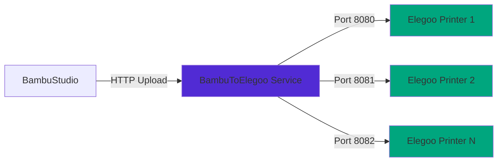

# BambuLab to Elegoo Bridge Service

A Windows Service that bridges BambuLab slicer (BambuStudio/OrcaSlicer) to Elegoo 3D printers, enabling seamless network printing to multiple Elegoo printers simultaneously.

**DISCLAIMER** This project is vibe coded and creates a service constantly listening to a port, its possible there is a vunerability. Its good enough for me and I will leave it to people smarter than me to check it, if they care to do so. I used Claude Sonnet 4.5 with github copilot.

> **Note:** Currently tested and confirmed working on **Elegoo Centauri Carbon (ECC)**. Other Elegoo printers may work but have not been tested. Please report your results!

[](https://dotnet.microsoft.com/)
[](LICENSE)
[](https://www.microsoft.com/windows)
[](https://github.com/yourusername/BambuToElegooService)

## Features

- ✅ **Windows Service** - Runs automatically at Windows startup
- ✅ **Multi-Printer Support** - Manage unlimited Elegoo printers simultaneously
- ✅ **Auto-Configuration** - Saves printer IPs and auto-reconnects
- ✅ **Easy Setup** - Interactive console for printer management
- ✅ **Auto Profile Install** - Automatically installs Elegoo profiles for BambuStudio
- ✅ **WebSocket Print Start** - Automatically starts prints after upload
- ✅ **Health Monitoring** - Detects and manages unreachable printers

## Prerequisites

- **Windows 10/11** or Windows Server 2016+
- **.NET 10.0 Runtime** ([Download here](https://dotnet.microsoft.com/download/dotnet/10.0)) - **REQUIRED**
  - Download the **ASP.NET Core Runtime 10.0.x (Hosting Bundle)** for Windows
- **BambuStudio** or **OrcaSlicer** installed
- **Elegoo 3D Printer** with network connectivity (currently tested with Elegoo Centauri Carbon)
- **Administrator rights** for first-run profile installation and service installation

## Quick Start

### 1. Download and Extract

Download the latest release and extract to a folder (e.g., `C:\BambuToElegooService\`)

**Important:** Keep the `runtime` folder with the executable. It contains required .NET libraries (~2.3 MB total).

### 2. Add Elegoo Profiles (Optional)

Add other Elegoo printer profiles in the Elegoo folder (This only comes with profiles for the Centuri Carbon)
You can get Elegoo printer profiles from the Elegoo slicer.
There are 2 different ECC folders, one contains nozzle print profiles, and the other contains the printer profiles.
### 3. Initial Configuration

Double-click `BambuToElegooService.exe` or run from terminal:

```powershell
.\BambuToElegooService.exe
```

The program will:
1. 📁 Install ECC profiles to BambuStudio if not already present (first run only)
2. 🖨️ Prompt for your printer's IP address
3. 🔍 Test the connection
4. 💾 Save the configuration
5. ✅ Show the assigned port number

### 4. Install as Windows Service

**Option A: Using Installation Script (Easiest)**

Use the batch file:
- Right-click `install-service.bat` → **Run as administrator**

Or Right-click **PowerShell** → **Run as Administrator**, then:

```powershell
cd "C:\Path\To\BambuToElegooService"
.\install-service.ps1
```


**Option B: Manual Installation**

Open **Command Prompt as Administrator**:

```cmd
cd C:\Path\To\BambuToElegooService
sc create "BambuToElegooService" binPath= "%CD%\BambuToElegooService.exe --service" start= auto
sc description "BambuToElegooService" "Bridges BambuLab slicer to Elegoo 3D printers"
sc start "BambuToElegooService"
```

### 5. Configure BambuStudio/OrcaSlicer

1. Add the printer in **BambuStudio**
2. In **BambuStudio**, click the **Wi-Fi button** next to a printer in your printer list
3. For **Host Type**, select **OctoPrint**
4. Enter the connection details:
   - **Hostname:** `localhost:8080` (use the port number shown during setup for that specific printer)
   - **Device UI:** Your printer's IP address (e.g., `192.168.1.100`)
   - **API Key:** Leave blank
5. Click **OK**

### 6. Start Printing! 🎉


---

## Managing Multiple Printers

### Adding More Printers

1. Run the executable interactively:
   ```powershell
   .\BambuToElegooService.exe
   ```
2. When prompted, enter the new printer's IP address
3. Give it a friendly name
4. Restart the service:
   ```powershell
   sc stop BambuToElegooService
   sc start BambuToElegooService
   ```
5. Add another OctoPrint server in BambuStudio with the new port

### Removing Unreachable Printers

The service automatically detects unreachable printers:

1. Run `BambuToElegooService.exe`
2. It will test all configured printers
3. Answer **yes** when prompted to remove unreachable ones
4. Restart the service

### Port Assignments

Each printer automatically gets its own port:
- **First printer:** Port 8080
- **Second printer:** Port 8081
- **Third printer:** Port 8082
- And so on...

---

## Service Management

| Action | Command |
|--------|---------|
| **Check Status** | `sc query BambuToElegooService` |
| **Start** | `sc start BambuToElegooService` |
| **Stop** | `sc stop BambuToElegooService` |
| **Restart** | `sc stop BambuToElegooService && sc start BambuToElegooService` |
| **Uninstall** | `.\uninstall-service.bat` (as Admin)<br>or `sc delete BambuToElegooService` |

---

## Troubleshooting

### 🔴 Service Won't Start

**Solution:**
1. Run the executable interactively first to configure at least one printer
2. Verify printer IPs are correct and printers are online
3. Check **Event Viewer** → **Windows Logs** → **Application** for errors

### 🔴 Printer Won't Connect

**Solution:**
1. Run interactively to see detailed connection logs
2. Verify printer is powered on and connected to network
3. Test access by opening `http://{printer-ip}` in your browser
4. Check printer's IP address hasn't changed

### 🔴 BambuStudio Can't Find Service

**Solution:**
1. Verify service is running: `sc query BambuToElegooService`
2. Check you're using the correct port in BambuStudio
3. Try `127.0.0.1` instead of `localhost`
4. Check Windows Firewall isn't blocking the connection

### 🔴 Elegoo Profiles Not Installing

**Solution:**
1. The program will prompt for custom paths if standard locations aren't found
2. Manually copy `Elegoo` folder to:
   - `%AppData%\BambuStudio\system\Elegoo`
   - `C:\Program Files\Bambu Studio\resources\profiles\Elegoo`

### 🔴 "Access Denied" Error

**Solution:**
- Run PowerShell or Command Prompt **as Administrator**
- Right-click → **Run as administrator**

### 🔴 Need to Change Printer IP

**Solution:**
1. Edit `C:\ProgramData\BambuToElegooService\config.json`
2. Or remove and re-add the printer using the interactive mode
3. Restart the service

---

## File Locations

| Item | Location |
|------|----------|
| **EXE Shortcut** | `BambuToElegooService.exe - Shortcut` |
| **Executable** | `runtime\BambuToElegooService.exe` |
| **Runtime Libraries** | `runtime\` folder (~2.3 MB of .NET DLLs) |
| **Elegoo Profiles (Bundled)** | `Elegoo\` folder |
| **Configuration** | `C:\ProgramData\BambuToElegooService\config.json` |
| **Upload Directories** | `{ExeDirectory}\uploads_{port}\` |
| **Service Logs** | Windows Event Viewer → Application Log |
| **Elegoo Profiles (Installed)** | `%AppData%\BambuStudio\system\Elegoo`<br>`C:\Program Files\Bambu Studio\resources\profiles\Elegoo` |

---

## How It Works



1. **BambuStudio** sends G-code file to `localhost:8080` (OctoPrint API)
2. **Service** receives file and forwards to corresponding Elegoo printer
3. **Service** uploads file via HTTP to printer's web interface
4. **Service** sends WebSocket command to start the print automatically
5. **Print starts** on the Elegoo printer

---

## Building from Source

### Requirements
- Visual Studio 2022+ or .NET 10.0 SDK
- Windows 10/11

### Steps

1. Clone the repository:
   ```bash
   git clone https://github.com/yourusername/BambuToElegooService.git
   cd BambuToElegooService
   ```

2. Build the project:
   ```powershell
   dotnet build -c Release
   ```

3. Run the executable:
   ```powershell
   cd bin\Release\net10.0
   .\BambuToElegooService.exe
   ```

### Creating a Release Package

```powershell
dotnet publish -c Release -r win-x64 --self-contained false
```

The output will be in `bin\Release\net10.0\win-x64\publish\`

---

## Contributing

Contributions are welcome! Please feel free to submit a Pull Request.

### Development Setup

1. Fork the repository
2. Create a feature branch: `git checkout -b feature/amazing-feature`
3. Make your changes
4. Test thoroughly
5. Commit: `git commit -m 'Add amazing feature'`
6. Push: `git push origin feature/amazing-feature`
7. Open a Pull Request

---

## Tested Hardware

| Printer Model | Status | Notes |
|---------------|--------|-------|
| Elegoo Centauri Carbon (ECC) | ✅ Tested | Fully working - Primary development hardware |
| Elegoo Neptune 4 Series | ⚠️ Untested | Should work (uses same web interface) |
| Other Elegoo Printers | ⚠️ Untested | May work if they use similar web API |

*If you test with other models, please report results via [Issues](https://github.com/yourusername/BambuToElegooService/issues)!*

---

## Compatibility

| Software | Status |
|----------|--------|
| BambuStudio | ✅ Tested |
| OrcaSlicer | ⚠️ Should work |
| PrusaSlicer | ⚠️ Not tested |

---

## License

This project is licensed under the MIT License - see the [LICENSE](LICENSE) file for details.

---

## Acknowledgments

- Inspired by the need to use BambuStudio with Elegoo printers
- Built with [.NET](https://dotnet.microsoft.com/)
- Uses [Microsoft.Extensions.Hosting](https://www.nuget.org/packages/Microsoft.Extensions.Hosting) for Windows Service support

---

## Support

- 🐛 **Bug Reports:** [Open an issue](https://github.com/yourusername/BambuToElegooService/issues)
- 💡 **Feature Requests:** [Open an issue](https://github.com/yourusername/BambuToElegooService/issues)
- 📖 **Documentation:** Check this README and the `/docs` folder
- 💬 **Discussions:** [GitHub Discussions](https://github.com/yourusername/BambuToElegooService/discussions)

---

## Disclaimer

This is an unofficial, community-developed tool. It is not affiliated with, endorsed by, or supported by Bambu Lab or Elegoo. Use at your own risk.

---

**Made with ❤️ for the 3D printing community**
- **Configuration:** `C:\ProgramData\BambuToElegooService\config.json`
- **Upload Directory:** `{ExeDirectory}\uploads_{port}\`
- **ECC Profiles:** Installed to BambuStudio directories

## Requirements

- Windows 10/11 or Windows Server
- .NET 10.0 Runtime or later
- Elegoo 3D Printer with network connectivity
- BambuStudio or BambuLab slicer

## Advanced Usage

### Running Multiple Instances
The service automatically manages multiple printers. Each printer:
- Gets its own OctoPrint server on a unique port
- Has independent upload directories
- Can be managed separately through the interactive interface

### Console vs Service Mode
- **Console Mode (Default):** Shows detailed logs, interactive setup
- **Service Mode (`--service` flag):** Runs silently as Windows Service

## Support

If you encounter issues:
1. Run interactively to see detailed logs
2. Check Windows Event Viewer for service errors
3. Verify network connectivity to printers
4. Ensure BambuStudio is configured with the correct ports
